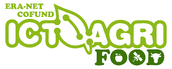

# Repository for the UNIBO data production of the ICT-AGRI  SHEET project
____

 

**What is the purpose of the SHEET project?**\
Purpose of **SHEET** (***S**unburn and **HE**at prediction in canopies for **E**volving a warning **T**ech solution* - https://ictagrifood.eu/node/44656) project is to develop risk prediction models for heat damage in the fruit production and transfer the model in a [functional mobile application on the smart phone](***LINK TO SHEET APP GITHUB when ready***).

Global radiation and temperature rise cause huge risks for the fruit production already affecting the fruit quality, storability, and increasingly results in food waste.
Experimental data will capture apple, grape, and sweet cherry production in varying elevation, global radiation, and precipitation.

*The project SHEET is part of the ERA-NET Cofund ICT-AGRI-FOOD, with funding provided by national sources and co-funding by the European Union’s Horizon 2020 research and innovation program, Grant Agreement number 862665*.

**Which type of data will produce the project?**\
Experimental data will capture seasonal weather data as well as fruit temperature, fruit sunburn (SB) occurrence and SB symptoms level, in varying climatic condition, on apple, cherry and grape fruit species.

### More information regarding the SHEET project outcomes  from all the partners can be found HERE(***LINK TO SHEET APP GITHUB when ready***)
____
## 
 This page will remain under development / update until the end of 2024 

## Involved people at UniBo
Institution: [*University of Bologna*](https://www.unibo.it/it)

|Full Name | contact| role|
|:---|---|---|
|Brunella Morandi | brunella.morandi@unibo.it| Project Head and research on apple physiology |
|Luigi Manfrini | luigi.manfrini@unibo.it| Research on apple physiology |
|Alexandra Boini | alexandra.boini@unibo.it| Research on apple physiology|
|Crisitano Franceschini | cristia.franceschin2@unibo.it | Research on apple physiology|
|Michele Gullino| --- | Research on apple physiology|
|Gianmarco Bortolotti| gianmarco.bortolotti@unibo.it| Research on apple physiology and tech development|
|Mirko Piani | mirko.piani2@unibo.it| Data management - tech development - Programmer |
|Dario Mengoli | dario.mengoli2@unibo.it|  Data management - tech development - Programmer |
|Nicolò Omodei| nicolo.omodei@unibo.it|  Data management - tech development - Programmer |
|Simone Rossi | simone.rossi39@unibo.it|  Data management - tech development - Programmer |
|Ilaria FIlippetti | ilaria.filippetti@unibo.it | Research on grape physiology|
|Gianluca Allegro | gianluca.allegro2@unibo.it | Research on grape physiology|
|Daniela Sangiorgio| daniela.sangiorgio2@unibo.it | Research on grape physiology| 
|Chiara Pastore| chiara.pastore@unibo.it | Research on grape physiology|  

 

## Project timeline and results obtained
The SHEET project has been programmed to start in 2021 and to end in 2024.

### 2021- 2022
* **Experimental set-up and first year physiologial data collection** ([Open Acces Apple Fruit position and temperature data](https://zenodo.org/records/10805065) -  [[documentation here](/Docs/README-OA_Apple_Fruit_pos_and_temp_data%20.pdf)])
* Initial **data collection** and **model training** for development of the **RGB-D/Thermal scanning Platform**
### 2022 - 2023
* Second year **physiologial data collection** ([Open Acces Apple Fruit position and temperature data](https://zenodo.org/records/10805065) - [[documentation here](/Docs/README-OA_Apple_Fruit_pos_and_temp_data%20.pdf)])
* Development of **fruit and trunk detection models** used in the RGB-D-Thermal scanning Platform 
* Development of the first version of an [**RGB-D/Thermal scanning Platform**](https://github.com/ECOPOM/SHEET_RGBD-T_system): A consumer grade RGB-D/Thermal scanning platfrom was developped and tested in field for its performance as a low cost solution compared to the research level [solution proposed from ATB](https://doi.org/10.1016/j.mex.2022.101712). More information can be found in ***Development of a consumer-grade scanning platform for fruit thermal and position data collection*** [[paper](https://doi.org/10.1109/MetroAgriFor58484.2023.10424204) - [presentation](/Docs/PPT_Bortolotti_et_al_RGBD-Thermal_IEEE_2023_v1.pdf)]

### 2023 - 2024
* Third year  **physiologial data collection** ([Open Acces Apple Fruit position and temperature data](https://zenodo.org/records/10805065) - [[documentation here](/Docs/README-OA_Apple_Fruit_pos_and_temp_data%20.pdf)]) 

* Development of the second version of the [**RGB-D/Thermal scanning Platform**](https://github.com/ECOPOM/SHEET_RGBD-T_system). More information of this improved version can be found in "**A Low-cost RGB-D/thermal platform for monitoring fruit temperature with spatial resolution** [ ***IN PRESS*** - Conference Proceedings of the II International Symposium on Precision Management of Orchards and Vineyards. PMOV2024. 3-8 Dec 2023. Tatura, VIC, AUS - [presentation](/Docs/PPT_Bortolotti_et_al_TGBD-Thermal_ISHS_2023_v2.pdf)] 

###  2024
* Realease of [**Open Acces Apple Fruit position and temperature data**](https://zenodo.org/records/10805065) [[documentation here](/Docs/README-OA_Apple_Fruit_pos_and_temp_data%20.pdf)]: After the last season of data collection, **a chomprehensive dataset** of the climatic, physiological and fruit quality (Apple) data collected during the project was released.   It contains data of the trial site in Cadriano (Bologna, Italy) - at the experimental farm of the University of Bologna (44.54824 °N, 11.41449 °E) - organized by years (2021, 2022, and 2023) and related to:
  * **continuos weather data**, **continuos microclimatic data** of orchard conditions tested (2021 and 2022 only)
  * **discrete radiation** measurements of the illumination condition of each tested treatment,
  * **continuos measurements of apple fruit surface temperature** collected with thermocouples
  * **discrete measurements of apple fruit surface temperature** collected with handheld thermal camera (2022, 2023 only)
  *  **3D position of the fruit** monitored for surface temperature, 
  *  **discrete measurements of apple fruit surface temperature and position** collected with an RGB-D/ Thermal scanning platform prototype (2022 only),
  *   **discrete measurement** reporting the moment of s**unburn damage occurrence**, its **level**, **L\*a\*b\* chroma and Hue** color information, and **DA-meter** index values.

* Realease of [**SHEET project - Unibo Computer Vision Final Repository**](https://zenodo.org/doi/10.5281/zenodo.10956705)[[documentation here](/Docs/README_CV_Final_Repo_Unibo%20.md)]: The  repository contains all the computer-vision related datasets and models developped during the project. The repository contains:
  * **YOLOv5**  models for **apple fruit, grape cluster, and tree trunk detections** 
  * **YOLOv8** models for  **colse fruit detection + sunburn symptomps classification**
  * **Annotated datasets** used for the training of each model
  * **Code scripts** used to manage data and train the models

## Pubblications

* (2022) [How can we reach enhanced climate resilience considering sunburn and heat damage in fruit and vegetables production?](https://doi.org/10.17660/ActaHortic.2023.1372.44) - *Acta Horticulturae* ISHS

*  (2023) [Irrigation during ripening may reduce sunburn damages on berries of Vitis vinifera L. 'Sangiovese'](https://doi.org/10.17660/ActaHortic.2023.1366.46) - *Acta Horticulturae* ISHS 
*  (2023) [Apple responses to fruit sunburn in Italy'](https://doi.org/10.17660/ActaHortic.2023.1372.29) - *Acta Horticulturae* ISHS 
*  (2023) ['Development of a consumer-grade scanning platform for fruit thermal and position data collection'](https://doi.org/10.1109/MetroAgriFor58484.2023.10424204 ) - *IEEE 2023 MetroAgriFor Proceedings* IEEE Explorer 
*   (2023) ['Evaluation of fruit temperature on cherries by means of thermal point clouds'](https://doi.org/10.1109/MetroAgriFor58484.2023.10424355 ) - *IEEE 2023 MetroAgriFor Proceedings* IEEE Explorer 
   
*  (2023 - *IN PRESS*) '**A Low-cost RGB-D/thermal platform for monitoring fruit temperature with spatial resolution** - *ISHS PMOV proceedings - Acta Horticulturae* ISHS 
*  (2023 - *IN PRESS*) '**Assessment of the temperature threshold for the occurrence of sunburn damage in *Vitis vinifera* L. 'Sangiovese'** - *ISHS PMOV proceedings - Acta Horticulturae* ISHS 

*  (2023) '**Come gestire il meleto per ridurre l'incidenza delle scottature solari**'- *Rivista di Frutticoltura n.9* 
*  (2023) '**Sangiovese, l’irrigazione può ridurre le scottature**' - *L'Informatore Agrario* 
  

*  (2024 - *IN PRESS*) '**Mobile App for analysing the heat damage risk in grape** - *ISHS EHC proceedings - Acta Horticulturae* ISHS 
*  (2024 - *IN PRESS*) '**Effect of TiO2  spray application on storability of apple 'Gala'** - *ISHS EHC proceedings - Acta Horticulturae* ISHS 
*  (2024 - *IN PRESS*) '**Effects of zeolite application and irrigation on berry sunburn damage and vine performances in cv. Sangiovese (Vitis vinifera L.)** - *ISHS EHC proceedings - Acta Horticulturae* ISHS 
*  (2024 - *IN PRESS*) '**Sunburn Dynamics: Exploring Occurrence and Evolution on Vitis vinifera Berries - A Case Study of 'Sangiovese' and 'Pignoletto' Cultivars.** - *ISHS EHC proceedings - Acta Horticulturae* ISHS
*  (2024 - *IN PRESS*) '**Orchard management changes solar radiation profiles, influencing apple sunburn** - *ISHS EHC proceedings - Acta Horticulturae* ISHS  
*  (2024 - *IN PRESS*) '**Prevention of climate change induced sunburn damage on berries of Vitis vinifera L. with machine learning** - *Journal* Elsevier

## Fundings
This work was supported by the SHEET European project.
The project SHEET (Sunburn and heat prediction in canopies for evolving a warning tech solution) is part of the ERA-NET co-funded ICT-AGRI-FOOD, with funding provided by national sources (Italian Ministry of the University and Research) and co-funding by the European Union’s Horizon 2020 research and innovation program, Grant Agreement number 862665. https://ictagrifood.eu/node/44656
